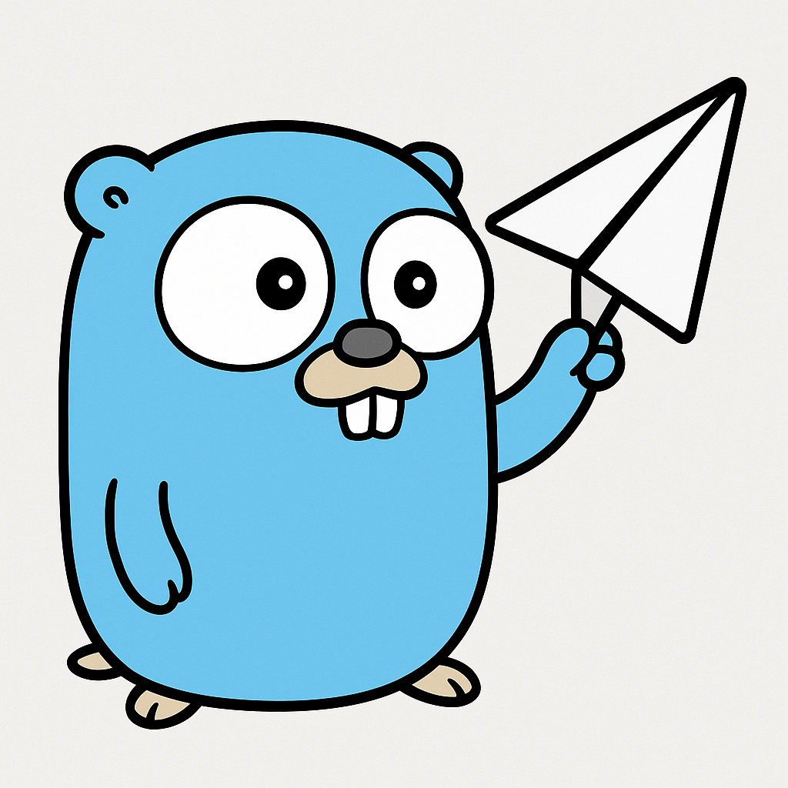
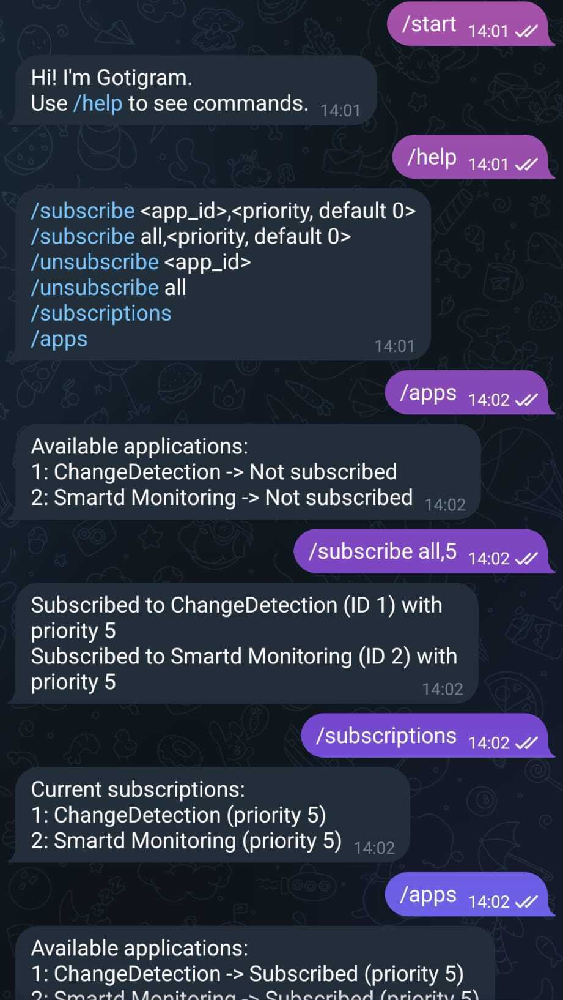

<p align="center">
  
</p>

<h1 align="center">Gotigram</h1>

Gotigram is a standalone Telegram bot that bridges your [Gotify](https://gotify.net) notifications directly to your [Telegram](https://telegram.org) DMs. It's designed to selectively forward messages from specific Gotify applications to Telegram, giving you full control over what gets pushed.

> **Note:** Gotigram is a separate application and not a Gotify plugin.

---

## 📋 Prerequisites

Before using Gotigram, ensure you have the following:

- A running **Gotify server**
- A **Telegram bot**

### Required Environment Variables

| Variable              | Description                                                                            |
|-----------------------|----------------------------------------------------------------------------------------|
| `GOTIFY_WS_URL`       | WebSocket URL of your Gotify server (e.g., `ws://gotify.com`)                          |
| `GOTIFY_REST_URL`     | REST API URL of your Gotify server (e.g., `http://gotify.com` or `https://gotify.com`) |
| `GOTIFY_CLIENT_TOKEN` | Token from Gotify "Clients" tab or an existing one                                     |
| `TELEGRAM_TOKEN`      | Token for your Telegram bot                                                            |
| `TELEGRAM_CHAT_ID`    | Your personal Telegram chat ID                                                         |


## 🔧 How to Get Your Telegram Token and Chat ID

1. **Create a Telegram Bot**  
   Talk to [@BotFather](https://t.me/BotFather) and use the `/newbot` command to create your bot.  
   You’ll receive a **bot token** — save this, it will be your `TELEGRAM_TOKEN`.

2. **Get Your Chat ID**  
   - Start a conversation with your bot (send `/start`)  
   - Visit: `https://api.telegram.org/bot<TELEGRAM_TOKEN>/getUpdates`  
     *(replace `<TELEGRAM_TOKEN>` with your actual token)*  
   - Your `chat.id` will appear in the response — that’s your `TELEGRAM_CHAT_ID`.


## 🚀 Getting Started

### Option 1: Run Locally

```bash
git clone https://github.com/your-username/gotigram.git
cd gotigram
pip3 install -r requirements
python3 main.py
```

### Option 2: Run via Docker

#### Using a local build

Example file: local-docker-compose.yml

```bash
docker-compose -f local-docker-compose.yml up -d
```

#### Using Docker Hub image

Example file: docker-compose.yml

```bash
docker-compose -f docker-compose.yml up -d
```


## 💬 Bot Usage

Once the bot is running, open a Telegram chat with it and send the `/start` command to begin. This step is optional but recommended, as it displays all available commands.

### Available Commands

- `/help` – Show help message  
- `/subscribe <app_id>` – Subscribe to an application  
- `/unsubscribe <app_id>` – Unsubscribe from an application  
- `/subscriptions` – Show current subscriptions  
- `/apps` – List all applications on your Gotify server  


## 📥 Subscribing to Applications

To start receiving Gotify messages in Telegram, you must subscribe to specific applications. This allows you to filter which messages you want forwarded. To find application IDs, use the command:

```
/apps
```

### Example



## 🛠️ To-Do

- Add support for priority-based subscriptions  
  Allow users to subscribe to a Gotify application **and specify a minimum message priority**. Only messages with that priority or higher will be pushed to Telegram.

## 🧾 License

This project is open-source and available under the [MIT License](LICENSE).


## 🤝 Contributing

Feel free to open issues or submit pull requests to improve Gotigram!

